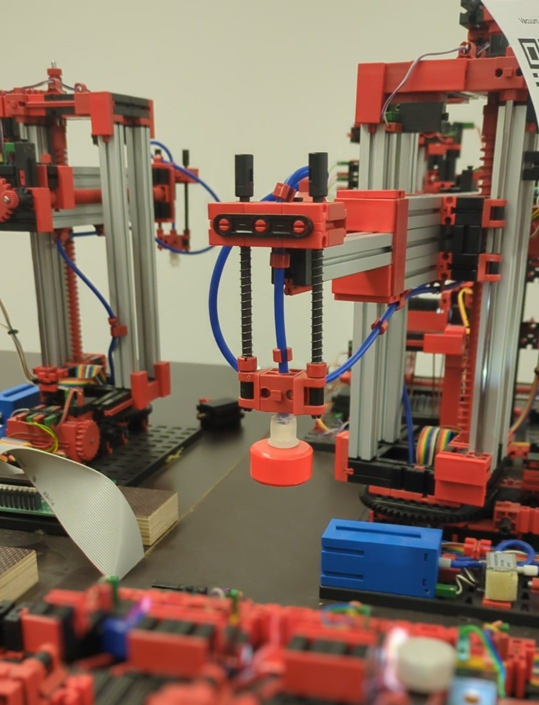
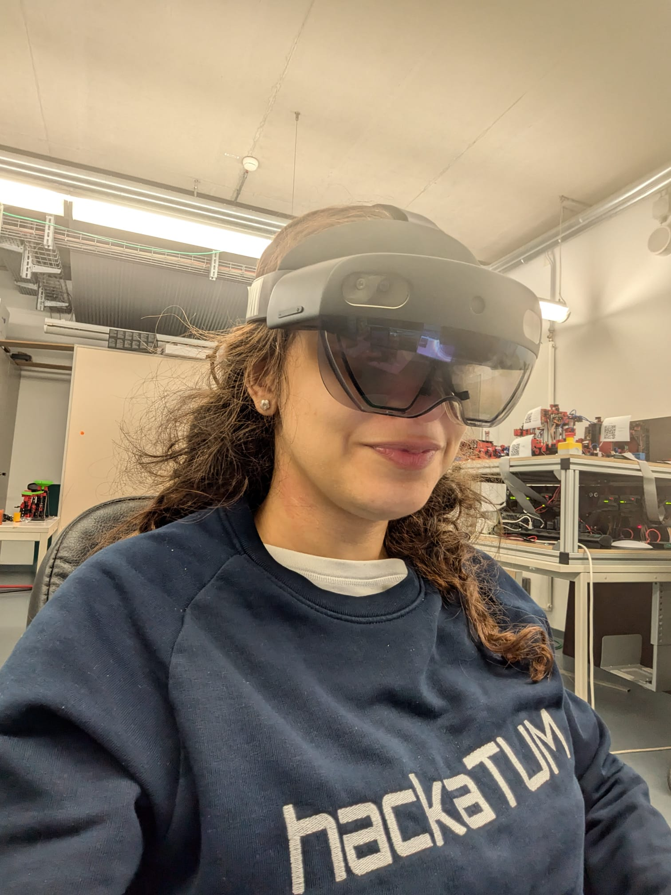
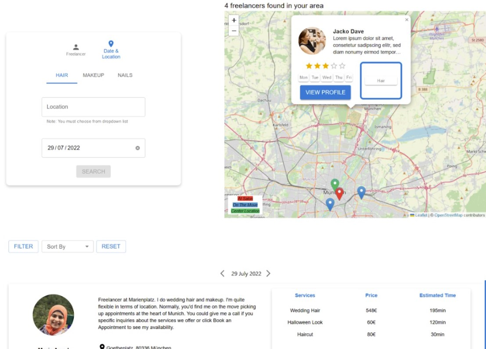
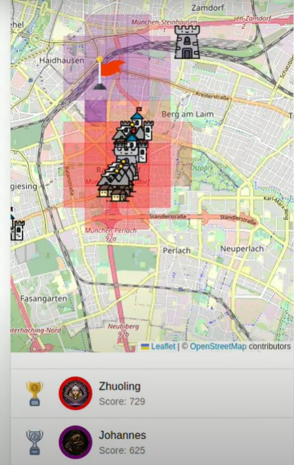
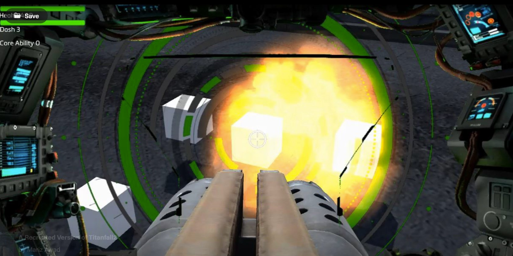
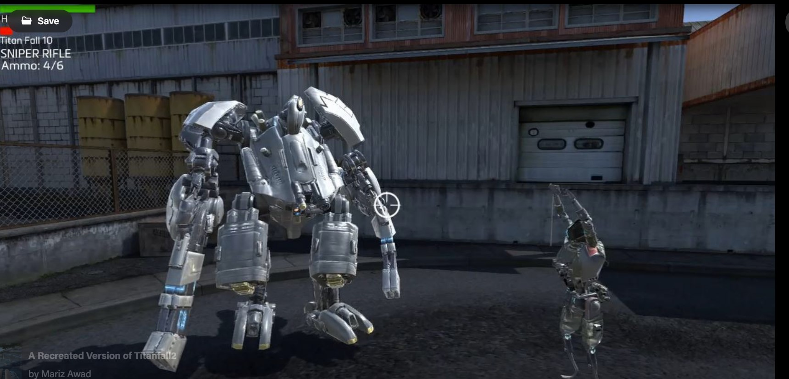
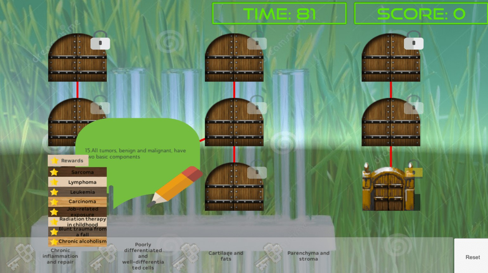
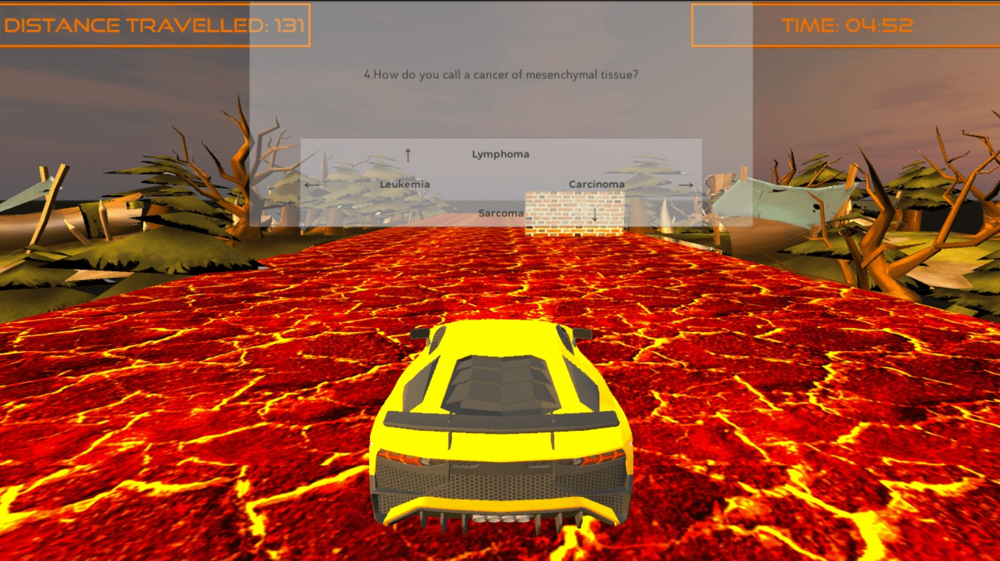
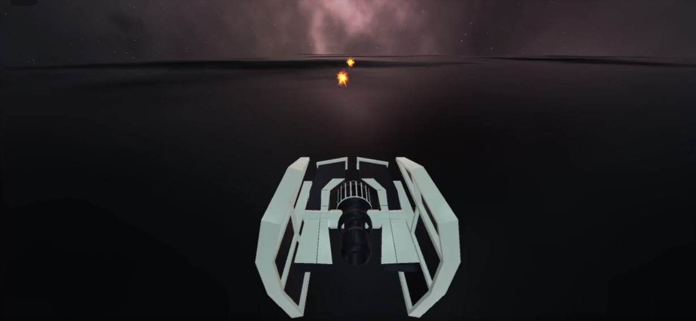

# Hi, I'm Mariz.
As you can see from my projects, I like to keep things tech-agnostic — from building MERN stack web apps to crafting games in Unity, I’m all about diving into whatever tech fits the challenge (or just seems fun to try).

---

# Projects

### <a href="https://www.behance.net/gallery/219779283/HoloWot20-Connecting-IoT-Devices-in-Mixed-Reality?error=invalid_scope" target="_blank" rel="noopener noreferrer">Master Thesis: HoloWoT 2.0</a>

  
  

 A low-code framework for connecting and controlling IoT devices in a Mixed Reality environment.

 In this project I:
- **Redesigned the interface** of the HoloWot 1.0 application, where **usability studies** yielded an **average rating of 4.21/5** across key UI elements.
- **Engineered a low-code process** of creating mashups in a MR environment tailored for industrial settings.
- Participated in the **development of** the **WoT.Net library; a scripting API** based on W3C standards.
- Checkout the <a href="https://www.behance.net/gallery/219779283/HoloWot20-Connecting-IoT-Devices-in-Mixed-Reality?error=invalid_scope" target="_blank" rel="noopener noreferrer">video demo on Behance</a> or watch the <a href="https://www.youtube.com/live/e8iBIOo6fb0?si=b9eN-O429DE8Ts3x&t=2260" target="_blank" rel="noopener noreferrer">presentation at the Deutsches Museum on Youtube</a> (German).

**Tech:** ``Unity``, ``C#``, ``Mixed Reality Toolkit 3``, ``Web of Things (WoT)``

---

### <a href="https://mnakhla.github.io/GlowishFrontend/" target="_blank" rel="noopener noreferrer">GloWish: Freelancing Platform</a>

  

A freelancing platform that connects up-and-coming beauty artists with clients, offering an automated appointment booking system.

In this project I:
- **Managed a 3-person team** to build the website in an **agile** manner.
-  Collaborated with the team to brainstorm the idea and **develop the business model** and value proposition.
- Designed and **developed backend and frontend** functionalities of the freelancer profile and appointments management system.
- Check out the technical considerations that we took in the <a href="https://mnakhla.github.io/GlowishFrontend/" target="_blank" rel="noopener noreferrer">project documentation</a>.

**Tech:** ``MERN Stack``, ``React Leaflet``, ``MongoDB``, ``ReactJS``, ``Node.js``, ``ExpressJS``, ``JavaScript``

---
### <a href="https://devpost.com/software/conquershot" target="_blank" rel="noopener noreferrer">🏆 HackaTUM 2022: 2nd Place winner of Huawei Competition</a>

  

Conquershot:  A smart gamification idea for labeling tasks on OpenStreetMap.

**Tech:** ``ReactJS``, ``OpenStreetMap``, ``Javascript``

---

### <a href="https://www.behance.net/gallery/103365935/A-Recreated-Version-of-Titanfall2" target="_blank" rel="noopener noreferrer">Titanfall2 FPS</a>

  
  

A FPS game inspired by Titanfall2.

In this project I:
- **Led a team of 5** software developers where I divided the workload, delegated tasks and monitored performance in order to meet a specific **deadline**.
- **Programmed** the **Physics** involved in the different **weapon firing modes**, **projectiles**, and Titan character abilities.

**Tech:** ``Unity``, ``C#``

---
### [Bachelor Thesis: A-Learning Platform](https://www.behance.net/gallery/103471519/Platform-of-3-Educational-Games)

  
  

Platform of 5 serious games embedded with a pool of MCQs, featuring an AI engine that adapts the difficulty to the player's performance.

In this project I:
- **Conducted a literature review** on different serious games and **Computer Adaptive Testing (CAT)**.
- **Developed a platform of 5 games** designed for MCQs.
- **Built an AI engine** that **adapts question difficulty** to user performance, boosting **learning efficiency (Δ=0.083, p<.001)** vs. sequential systems.
- **Developed a low-code editor** where the educator can install their own questions and retrain the model.
- Check out the paper publication on <a href="https://www.scitepress.org/PublicationsDetail.aspx?ID=T5qjNFqo8q8=&t=1" target="_blank" rel="noopener noreferrer">scitepress</a>.

**Tech:** ``Unity``, ``C#``, ``Bayesian Machine Learning``

---
### <a href="https://www.behance.net/gallery/103468513/3D-Modeling-of-a-Spaceship" target="_blank" rel="noopener noreferrer">3D Modeling of a Spaceship</a>

  
  

3D modeling and animation of a Spaceship with particle effects and simple graph shader.

**Tech:** ``Autodesk Maya``, ``Unity``

---

## 📫 Contact

- GitHub: <a href="https://github.com/marzi333" target="_blank" rel="noopener noreferrer">@marzi333</a>
- Email: <a href="mailto:mariz.awad97@gmail.com" target="_blank" rel="noopener noreferrer">mariz.awad97@gmail.com</a>
- LinkedIn: <a href="https://www.linkedin.com/in/mariz-awad-m-sc-4354a1120/" target="_blank" rel="noopener noreferrer">@mariz-awad-m-sc-4354a1120</a>

